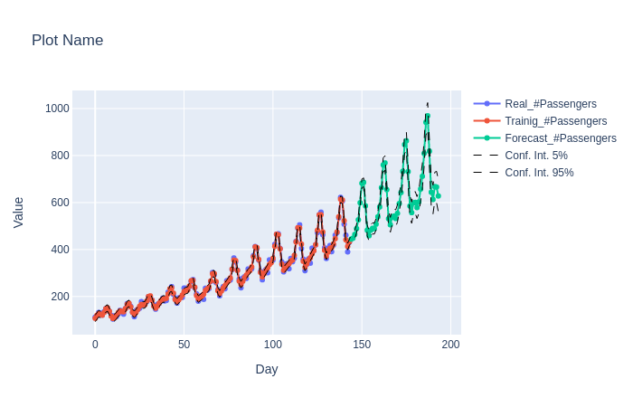
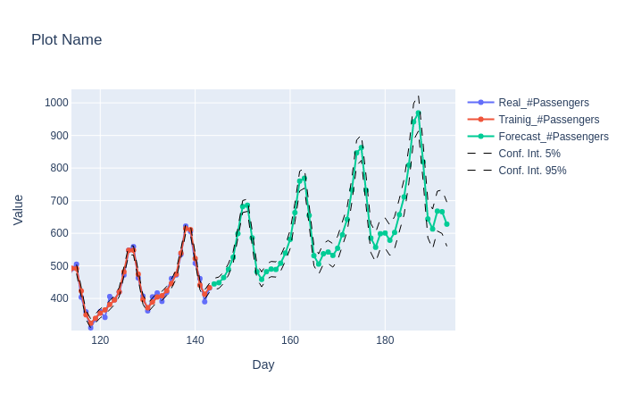

## Python realization of Multivariate SSA algorithm

Minimal numpy realization of Multivariate Singular Spectrum Analysis algorithm.

Main functions:
- Time Series decomposition for components.
- Recurrent forecasting algorithm.

The using tutorial is given in the jupyter notebook with corresponding name.

**Data:** `data` folder includes 2 datasets:
- AirPassengers dataset
- Artificial dataset

**Result example:**

| Example of forecast on Air Passengers | Zoom |
|---|---|
|  |  |

