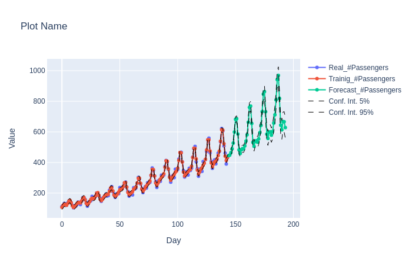
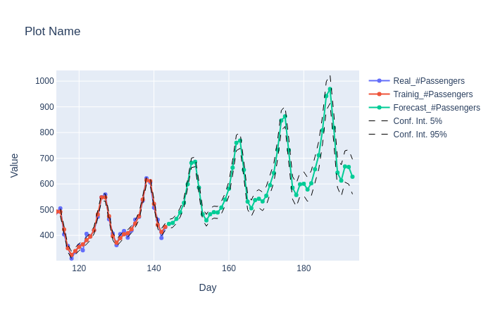
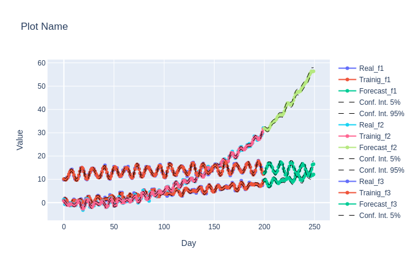
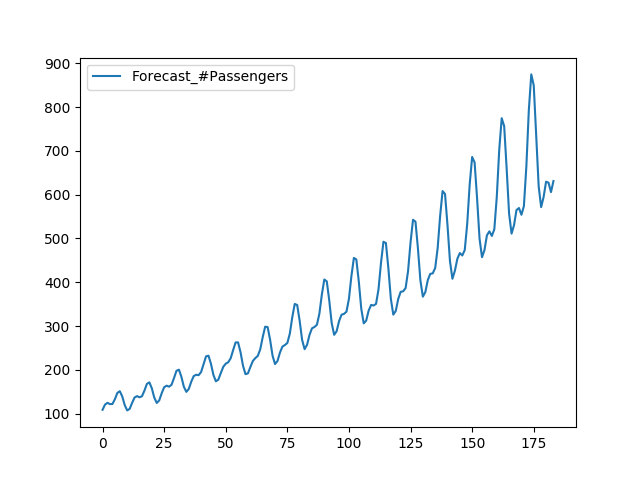
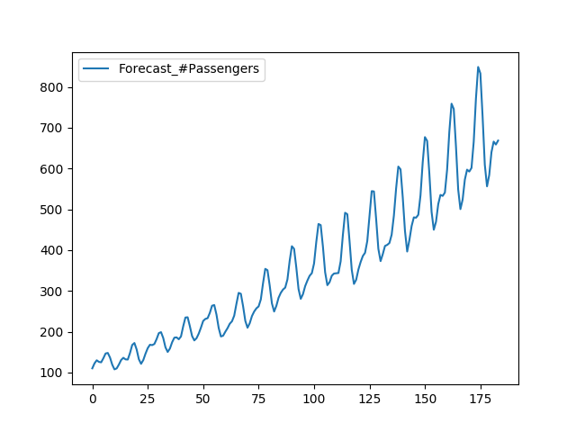

## Python realization of Multivariate SSA algorithm

(2017)

Numpy realization of Multivariate Singular Spectrum Analysis algorithm.

Main functions:
- Time Series decomposition for components.
- Recurrent forecasting algorithm.

**Data:**

`data` folder includes 2 datasets:
- AirPassengers dataset
- Artificial dataset

**SSA:**

- numpy
- plotly for visualization

**Usage from `main.py` with results images.**

SSA class:

```python
ts = pd.read_csv(DATASET_AIR, parse_dates=True, index_col=0)

ssa = SSA(ts)
ssa.decompose(20)
ssa.RLforecast(7, steps=50)
ssa.plot(plot_series=[0],
         title='Plot Name',
         x_ax='Day',
         y_ax='Value',
         output_folder=IMG_DIR,
         file_name='plot1')
```



Zoom:



```python
ts = pd.read_csv(DATASET_ART, parse_dates=True, index_col=0)

ssa = SSA(ts)
ssa.decompose(20)
ssa.RLforecast(7, steps=50)
ssa.plot(plot_series=[0, 1, 2],
         title='Plot Name',
         x_ax='Day',
         y_ax='Value',
         output_folder=IMG_DIR,
         file_name='plot2')
```



MSSA class:

```python
ts = pd.read_csv(DATASET_AIR, parse_dates=True, index_col=0)

ssa = MSSA(ts)
## Decomposition
ssa.embed(embedding_dimension=2)
ssa.decompose()
b = ssa.diag_procedure()
```

Two types of forecast:

- L-Reccurent forecast

```python
ssa.embed(embedding_dimension=20)
ssa.decompose()
ssa.group_components(5)
forc = ssa.L_reccurent_forecast(40)
inter = ssa.conf_int()
plt.figure()
forc.plot()
plt.savefig(IMG_DIR + "fig_L_reccurent_forecast.png")
```



- K-Reccurent forecast

```python
ssa.embed(embedding_dimension=10)
ssa.decompose()
ssa.group_components(5)
forc = ssa.K_reccurent_forecast(40)
plt.figure()
forc.plot()
plt.savefig(IMG_DIR + "fig_K_reccurent_forecast.png")
```


